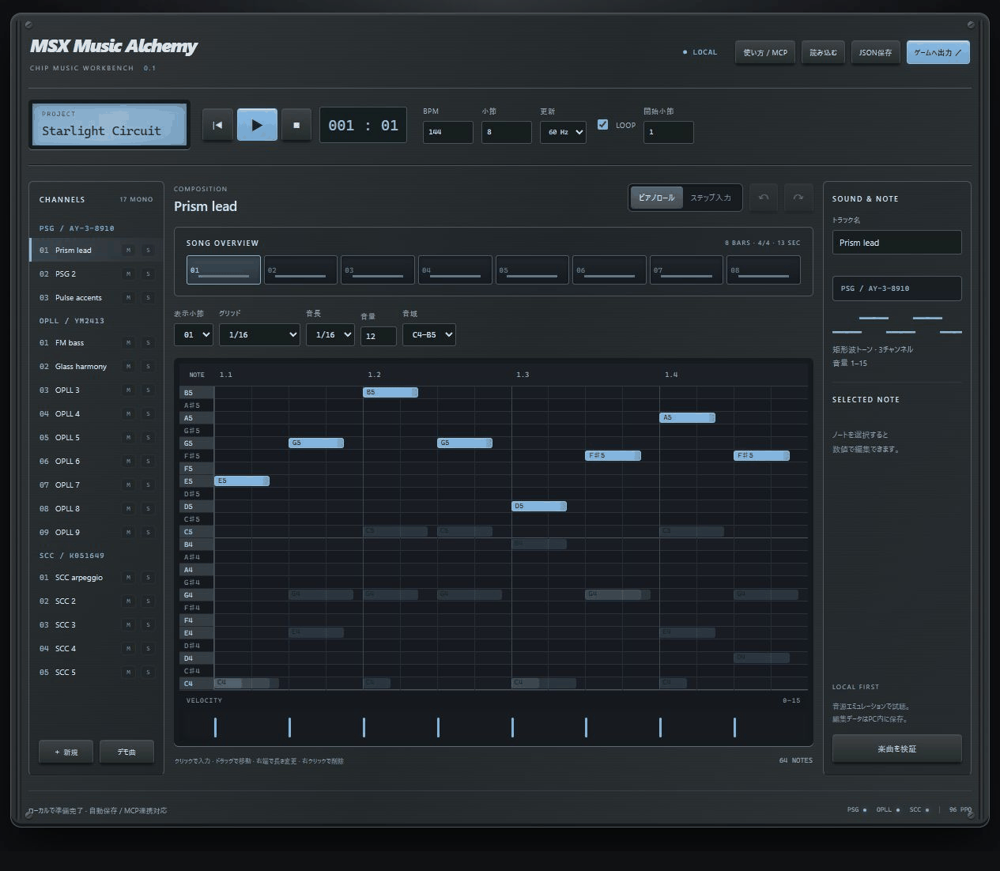

# MSX Music Alchemy v0.4.0

**Turn ideas into chip music.** A local-first PSG / OPLL / SCC music editor with a piano roll,
step entry, game-ready data exports, and an MCP server for AI-assisted composition.



[Windows x64 download](https://github.com/kanon-ai/msx-music-alchemy/releases/latest) ·
[使用方法](docs/USER_GUIDE.md) · [MCP設定](MCP_SETUP.md) · [MIT License](LICENSE) · [免責事項](DISCLAIMER.md)

PSG / OPLL / SCC のローカル音楽エディタ。Windows PCのブラウザーで編集し、
ゲーム実装用データとAI作曲用のMCPインターフェイスを提供します。
非公式の独立したプロジェクトです。使用条件はLICENSEとDISCLAIMER.mdを参照してください。

## 起動

`start.bat` をダブルクリック（Python 3.10以降）。ブラウザーで http://127.0.0.1:7913 が開きます。
`python server.py --no-browser --port 7913` でも起動できます。
`bin/msx_render.exe` はWindows x64用のビルド済み音源エンジンです。
Python不要のWindows版はReleasesのZIPを展開し、`MSXMusicAlchemy.exe` を起動します。
ソースからパッケージした場合は `dist/MSXMusicAlchemy/MSXMusicAlchemy.exe` です。

## 編集

- 17トラック: PSG 3 / OPLL 9 / SCC 5。ピアノロールは1小節表示で曲全体の小節を切り替え。
- クリック追加、ドラッグ移動、右端ドラッグで音長、右クリック/Deleteで削除。
- ステップ入力: 音名ボタン／Z S X D C V G B H N J M。休符でカーソルを進める。
- Ctrl+Z / Ctrl+Y、音程・開始・音長・音量の数値編集、小節複製、mute/solo試聴。
- OPLL 15 ROM音色＋共通カスタム8バイト。SCCは波形プリセット／32サンプル手描き。
- 50/60 Hz、BPM、1–64小節、ループ開始小節。曲長5分まで。
- 変更は `data/autosave.json` に保存。JSON保存で任意の場所にプロジェクトを保管。
  JSON/MMLの読み込みは現在の曲を置き換えます（Undo可能）。外部変更の取得後はUndo履歴をリセット。
- AI／他のウィンドウとの競合は通知して上書きを止めます。JSON保存で作業を退避し再読込してください。

## 出力とMCP

ゲーム開発パックZIP: 編集JSON、schema、レジスタJSON、Cヘッダー、バイナリ、
VGM、C89スケジューラー、AI向け説明、組み込みガイド。WAVも個別出力できます。
「MGSDRV (.mgs)」で、PSG 3＋SCC 5＋FM 9パートを実機プレイヤー向けに出力できます。
60 Hz・最大16 KiB（バイナリ部分）。カスタムFM音色、SCC波形、ループに対応します。
使用方法と検証範囲は [MGSDRV出力](docs/MGSDRV_EXPORT.md)。
muteは出力に反映します。soloは試聴だけに適用し、出力には反映しません。
MCPは [MCP_SETUP.md](MCP_SETUP.md)、ゲームへの導入は [GAME_INTEGRATION.md](docs/GAME_INTEGRATION.md)。

## MCP作曲サンプル

[ジムノペディ第1番・Jazz arrangement](samples/gymnopedie-jazz/README.md) を同梱。
原調・全78小節、ビブラフォン＋16分エコー、アコースティックベース、OPLLリズム、PSGコーラス。
公開原譜の出典、ライセンス、MCPでの読み込み・検証・出力例を付属しています。

[シシリエンヌ・Cantabile](samples/sicilienne-cantabile/README.md) も公開しています。
CC0譜面の全86小節をFM中心に再配分し、PSGコーラスと薄いSCC補助を加えた例です。
再生成スクリプトとMCPクライアントを付属しています。

## MML

MGSDRV/MGSC 1.11のメロディ用基本構文をインポートします。
全仕様互換ではありません。対応範囲は [AI_COMPOSITION.md](docs/AI_COMPOSITION.md)。
UTF-8 / Shift-JISの.mus / .mml入力、貼り付けに対応。未対応構文はエラーで停止します。
公式仕様: https://p.gigamix.jp/mgsdrv/MGSC111.TXT
配布元: https://gigamix.hatenablog.com/entry/mgsdrv/

## 現時点の範囲

PSGは矩形波トーン。ノイズ／ハード・ソフトエンベロープは未対応。
OPLLは9音メロディ、または6音メロディ＋リズム（実験対応）。リズム時はOPLL 7〜9をドラムに使用します。リズム曲のMGS出力は未対応です。音色はトラック内で固定。
SCCは標準SCC（4/5ch波形共有）。SCC+専用モードは未対応。
テンポ・拍子は曲内固定。MMLの高度なマクロ、LFOなどは未対応。
汎用MMLからのMGSコンパイル、MIDI機器入力、実チップ出力、ROM自動生成は含みません。
MGSは編集データから直接生成します。MGSDRV本体・実機プレイヤーは別途必要です。
試聴は音源エミュレーションであり、MSX実機の動作確認とは別です。

## 開発・検証

Python標準ライブラリのみ。音源はCMakeとVisual Studio C++でビルド:

```powershell
powershell -ExecutionPolicy Bypass -File build.ps1
python -m unittest discover -s tests -v
node --check static/app.js
```

音源エミュレーターのソースとMITライセンスはvendor配下。
バージョン固定情報は [THIRD_PARTY.md](THIRD_PARTY.md)。
エディタ自体は音楽を外部送信しません。外部AIクライアントの送信先・保存方針は利用者の設定に依存します。
MCPクライアント設定の自動変更は行いません。

## License / Disclaimer

Original code: **MIT License**, copyright 2026 kanon-ai and contributors.
The bundled sound emulators retain their own MIT notices; Windows runtime notices are
included in the binary distribution. See [THIRD_PARTY.md](THIRD_PARTY.md).

本ツールは無保証・非公式の独立したプロジェクトです。音源の試聴はエミュレーションであり、
ゲーム用ドライバーの実機動作を保証するものではありません。詳細は [DISCLAIMER.md](DISCLAIMER.md)。
作成した楽曲そのものをMITで公開したり、このツールをクレジットしたりする義務はありません。
同梱コードを利用する場合は、そのライセンス表記を保持してください。

This software is provided **AS IS**, without warranty. It is not an official or endorsed
MSX product. The MCP server exposes composition/editing tools but includes no AI model.
The MML importer supports a documented MGSC subset, not full compatibility. Physical MSX
hardware has not been tested. Read [the disclaimer](DISCLAIMER.md) before integration.

## v0.4.0 音源更新

OPLLの再生エンジンをymfmへ変更し、旧エンジンで発音時に聞こえたクリックを改善しました。ツール再生・WAV・MP4に適用されます。実機の音を保証するものではありません。
配布MP4は従来の画面収録に新版の音声を同期して差し替えています。画面内のバージョン・音量表示は旧版です。
